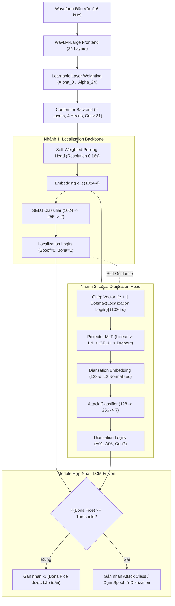

# WavLM-Conformer & Spoof Diarization Baseline for Speech Editing Detection & Localization (OOP Edition)

Hệ thống baseline cho bài toán **Speech Editing Detection & Localization** và mở rộng **Spoof Diarization** (phân định loại hình tấn công giả mạo theo chuẩn Zhang et al. Interspeech 2024 & Koo et al. 2025) sử dụng **WavLM-Large SSL Encoder (25-layer Learnable Weighting)**, **Conformer Backend**, **Local Diarization Head** và **Contrastive Segment Loss**, được thiết kế tinh gọn theo chuẩn **Lập trình Hướng đối tượng (OOP)**.

---

## 1. Cấu trúc thư mục

```
/GuestShare_NAS/WorkingSpace/Personal/nghiadq/WavLM-PartialSpoof/
├── config/
│   ├── baseline.yaml                  # Cấu hình Localization thuần túy
│   └── baseline_diarization.yaml      # Cấu hình Two-Branch Spoof Diarization Baseline
├── src/
│   ├── __init__.py                    # Export các class chính
│   ├── dataset.py                     # [OOP Data] PartialSpoofDataset & PartialSpoofDataModule
│   ├── model.py                       # [OOP Model] WavLMEncoder, ConformerEncoder, PoolHead, WavLMConformer, SpoofDiarizationHead, WavLMConformerDiarization
│   ├── criterion.py                   # [OOP Loss & Metrics] MaskedCrossEntropyLoss, ContrastiveSegmentLoss, TotalLoss, TotalDiarizationLoss, EERMetric, F1Metric, JERMetric, JIBonaMetric
│   └── pipeline.py                    # [OOP Lightning Module] WavLMConformerPipeline (hỗ trợ cả Detection & Diarization)
├── tools/
│   └── create_diarization_labels.py   # Script trích xuất nhãn phân đoạn đa lớp chi tiết (v1.3)
├── train.py                           # [Entrypoint] CLI Runner + tích hợp sẵn sanity check (--test-loss)
├── data/                              # Tài liệu & PDF tham khảo (Interspeech 2024, arXiv 2025)
├── logs/                              # Quản lý lượt chạy tự động (wavlm_conformer_contrastive, wavlm_diarization_baseline)
└── README.md
```

---

## 2. Thông tin Dữ liệu (PartialSpoof Protocol)

Dữ liệu được phân chia cố định theo giao thức chuẩn (Official Benchmark Protocol) để đảm bảo không bị rò rỉ người nói (speaker leakage):

| Phân vùng (Split) | Thư mục dữ liệu | File nhãn tương ứng | Số lượng file wav | Tỷ lệ trong dataset |
|---|---|---|---|---|
| **Train** (Huấn luyện) | `data/PartialSpoof/train/` | `train_seglab_0.16.npy` | **25,380 mẫu** | ~20.9% |
| **Validation / Dev** (Thẩm định) | `data/PartialSpoof/dev/` | `dev_seglab_0.16.npy` | **24,844 mẫu** | ~20.5% |
| **Test / Eval** (Đánh giá) | `data/PartialSpoof/eval/` | `eval_seglab_0.16.npy` | **71,237 mẫu** | ~58.6% |
| **Tổng cộng** | | | **121,461 mẫu** | **100%** |

---

## 3. Kiến trúc Chi tiết: Two-Branch Spoof Diarization Baseline

Hệ thống triển khai kiến trúc hai nhánh (**Two-Branch Architecture**) kết hợp cơ chế kiểm soát nhãn **Label-based Countermeasure Constraint (LCM)** theo Zhang et al. (*Interspeech 2024*) và Koo et al. (*2025*):



### 3.1. Nhánh 1: Localization Backbone (`WavLMConformer`)
- **SSL Audio Frontend**: Trích xuất biểu diễn từ `WavLM-Large` gồm 25 hidden states (1 CNN output + 24 Transformer layers) với trọng số tự học (**Learnable Layer Weighting** qua `s3prl_weighted`). Trọng số tầng học cách hòa trộn tối ưu đặc trưng âm học tầng thấp và ngữ nghĩa tầng cao. Trọng số WavLM được đóng băng (`freeze_ssl: true`) nhằm đảm bảo tính ổn định và tiết kiệm bộ nhớ GPU.
- **Conformer Backend Encoder**: Gồm 2 khối Conformer (4 attention heads, tích hợp Depthwise Convolution kernel size 31, FFN hidden dimension 1024, dropout 0.1) giúp mô hình hóa ngữ cảnh thời gian ngắn và dài.
- **Self-Weighted Pooling Head**: Sử dụng cơ chế self-attention pooling để gom cụm các frame raw SSL (bước nhảy $0.02s$) thành phân đoạn mục tiêu độ phân giải $0.16s$ ($8 \times 0.02s$), sinh ra embedding phân đoạn $\mathbf{e}_t \in \mathbb{R}^{1024}$.
- **Localization Classifier**: Khối MLP 2 tầng (`SELU -> Linear(1024, 256) -> SELU -> Linear(256, 2)`) dự đoán phân phối xác suất nhị phân giữa tiếng nói thật (`bona=1`) và tiếng nói bị chỉnh sửa (`spoof=0`).

### 3.2. Nhánh 2: Local Diarization Head (`SpoofDiarizationHead`)
- **Tận dụng biểu diễn Backbone**: Nhánh Diarization tái sử dụng trực tiếp embedding phân đoạn $\mathbf{e}_t \in \mathbb{R}^{1024}$ từ backbone, tránh tính toán lại SSL tốn kém.
- **Localization Guidance (`use_loc_guidance: true`)**: Nối phân phối xác suất hậu nghiệm (posterior probability) từ nhánh Localization $\mathbf{p}^{\text{loc}}_t = \text{Softmax}(\mathbf{l}^{\text{loc}}_t) \in \mathbb{R}^2$ trực tiếp vào vector embedding:
  $$\mathbf{x}_t = [\mathbf{e}_t \,\|\, \mathbf{p}^{\text{loc}}_t] \in \mathbb{R}^{1026}$$
  Tín hiệu định hướng mềm này giúp nhánh Diarization tập trung phân loại chi tiết các vùng âm thanh bị chỉnh sửa.
- **Projector & Embedding Head**: Chiếu qua `Linear(1026, 256) -> LayerNorm -> GELU -> Dropout(0.1)`, sau đó đưa qua `Linear(256, 128)` và chuẩn hóa $L_2$ để tạo ra vector đặc trưng $\tilde{\mathbf{z}}_t \in \mathbb{R}^{128}$ (sẵn sàng phục vụ phân cụm mở như AHC hoặc K-Means).
- **Multi-class Spoof Classifier**: Mạng phân loại đa lớp `Linear(128, 256) -> GELU -> Dropout(0.1) -> Linear(256, 7)` dự đoán 7 lớp tấn công đã biết trong tập huấn luyện/phát triển ($A01 \dots A06$ và phân đoạn nối $ConP$).

### 3.3. Module Kết Hợp: Label-based Countermeasure Constraint (LCM)
Module LCM (*Zhang et al. 2024*) được áp dụng trong giai đoạn suy luận (Inference / Testing) nhằm giải quyết hiện tượng báo động giả (False Alarms) của nhánh Diarization trên vùng tiếng nói thật:
$$\hat{y}_t = \begin{cases} -1 \quad (\text{Bona Fide}) & \text{nếu } P(BonaFide) \ge \tau \\ \arg\max_c (\mathbf{l}^{\text{dia}}_t[c]) & \text{nếu } P(BonaFide) < \tau \end{cases}$$
Nếu nhánh Localization nhận định một frame là tiếng nói thật với xác suất cao hơn ngưỡng $\tau$, frame đó được cố định nhãn $-1$ (Bona Fide). Chỉ những frame được xác định là giả mạo mới nhận nhãn tấn công từ nhánh Diarization.

### 3.4. Hàm Mất Mát Kết Hợp (Joint Loss Function)
Hệ thống được huấn luyện đồng thời với tổng hàm mất mát:
$$\mathcal{L}_{\text{Total}} = \mathcal{L}_{\text{Loc}} + \lambda_{\text{dia}} \cdot \mathcal{L}_{\text{Dia}}$$
- **$\mathcal{L}_{\text{Loc}} = \mathcal{L}_{\text{BCE}} + \lambda_{\text{cont}} \cdot \mathcal{L}_{\text{Contrastive}}$** ($\lambda_{\text{cont}} = 0.5$): Gồm Cross-Entropy nhị phân có mặt nạ padding và Contrastive Segment Loss (kéo gần các frame cùng nhãn về tâm cụm intra-class cohesion, đồng thời đẩy xa tâm cụm thật và giả inter-class separation qua margin $m=1.0$).
- **$\mathcal{L}_{\text{Dia}} = \text{MaskedCrossEntropyLoss}$** ($\lambda_{\text{dia}} = 1.0$): Phân loại đa lớp giữa các phương thức giả mạo. Thiết lập `spoof_only: true` đảm bảo chỉ tính gradient cho các frame thực sự bị giả mạo ground truth, không làm xáo trộn không gian biểu diễn tiếng nói thật.

### 3.5. Hệ Thống Đo Lường (Evaluation Metrics)
- **Chỉ số Localization**: Equal Error Rate (**EER %**), F1-Score (%), Segment Accuracy (%).
- **Chỉ số Diarization Chuẩn Hóa**:
  - **$\text{JI}_{\text{bona}}$ (%)** (*Jaccard Index Error for Bona Fide*): Sai số giao/hợp giữa vùng tiếng nói thật dự đoán và ground truth dưới điều kiện Oracle VAD (bỏ qua silence/non-speech).
  - **$\text{JER}_{\text{spoof}}$ (%)** (*Jaccard Error Rate for Spoof Attacks*): Tính sai số trung bình giữa các lớp tấn công giả mạo sử dụng thuật toán gán cặp Hungarian tối ưu (`linear_sum_assignment`) giữa các cụm dự đoán và nhãn tấn công ground truth trên từng câu nói.

---

## 4. Quản lý Logs & Lượt chạy (`run1`, `run2`, ...)

Hệ thống tự động tạo thư mục lượt chạy tăng dần bên trong `logs/` theo từng thí nghiệm:
```
logs/
├── wavlm_conformer_contrastive/       # Logs cho bài toán Localization thuần túy
│   ├── run9/                          # Baseline WavLM layer cuối
│   └── run13/                         # WavLM Learnable Layer Weighting
└── wavlm_diarization_baseline/        # Logs cho bài toán Two-Branch Spoof Diarization
    ├── run5/
    ├── run6/
    └── run7/                          # Baseline Diarization đầy đủ (7 classes, v1.3 labels)
        ├── train.log                  # Log chi tiết quá trình huấn luyện & đánh giá
        ├── hparams.yaml               # Toàn bộ cấu hình tham số của lượt chạy
        ├── test_results.txt           # Kết quả kiểm thử cuối (Loss, EER, Acc, F1, JI_bona, JER_spoof)
        └── checkpoints/               # Checkpoint lưu các epoch có val_eer tốt nhất
            └── best_eer_epoch=15_val_eer=12.90.ckpt
```

---

## 5. Hướng dẫn Chạy Chi tiết

### Bước 0: Môi trường thực thi
Các lệnh huấn luyện cần được chạy trong môi trường **Docker (`pytorch_nghiadq`)** và môi trường **Conda (`sal`)**:
```bash
# Cách 1: Vào trực tiếp container
docker exec -it pytorch_nghiadq bash
conda activate sal
cd /GuestShare_NAS/WorkingSpace/Personal/nghiadq/WavLM-PartialSpoof

# Cách 2: Chạy trực tiếp từ máy host
docker exec -it pytorch_nghiadq /GuestShare_NAS/WorkingSpace/Personal/nghiadq/miniconda3/envs/sal/bin/python /GuestShare_NAS/WorkingSpace/Personal/nghiadq/WavLM-PartialSpoof/train.py <arguments>
```

---

### 1. Kiểm tra nhanh Loss & Gradient Flow (Sanity Check)
```bash
python3 train.py --test-loss
```

---

### 2. Chạy thử nghiệm nhanh (Debug Mode)
Giới hạn 50 mẫu mỗi split và chạy 2 epochs:
```bash
python3 train.py --debug --max_samples 50 --batch_size 4 --max_epochs 2
```

---

### 3. Huấn luyện Full Toàn bộ Dữ liệu (Full Training)

#### A. Chạy mô hình Localization thuần túy (GPU mặc định)
```bash
python3 train.py --config config/baseline.yaml
```

#### B. Chạy mô hình Two-Branch Spoof Diarization Baseline
```bash
python3 train.py --config config/baseline_diarization.yaml
```

#### C. Huấn luyện Full có giới hạn CPU tối đa 100% (1 Core)
Khóa tiến trình chỉ chạy trên 1 core CPU duy nhất để tránh chiếm dụng tài nguyên máy chủ:
```bash
# Huấn luyện mô hình Diarization trên 1 core CPU duy nhất:
taskset -c 0 python3 train.py --config config/baseline_diarization.yaml

# Hoặc giới hạn số thread của PyTorch/OpenMP:
OMP_NUM_THREADS=1 MKL_NUM_THREADS=1 TORCH_NUM_THREADS=1 python3 train.py --config config/baseline_diarization.yaml
```

#### D. Chỉ định GPU cụ thể (ví dụ GPU 0 hoặc GPU 1)
```bash
CUDA_VISIBLE_DEVICES=0 taskset -c 0 python3 train.py --config config/baseline_diarization.yaml
```

#### E. Chạy ngầm trong background (với nohup)
```bash
CUDA_VISIBLE_DEVICES=0 taskset -c 0 nohup python3 train.py --config config/baseline_diarization.yaml > run_diarization.log 2>&1 &
```
*(Tiến trình tự động ghi log chi tiết vào `logs/wavlm_diarization_baseline/runX/train.log`)*

---

### 4. Đánh giá Mô hình từ Checkpoint (Test Only)

#### Đánh giá mô hình Localization:
```bash
python3 train.py --config config/baseline.yaml --test_only --ckpt_path logs/wavlm_conformer_contrastive/run13/checkpoints/best_eer_epoch=29_val_eer=15.20.ckpt
```

#### Đánh giá mô hình Spoof Diarization Baseline:
```bash
python3 train.py --config config/baseline_diarization.yaml --test_only --ckpt_path logs/wavlm_diarization_baseline/run7/checkpoints/best_eer_epoch=15_val_eer=12.90.ckpt
```

---

## 6. Kết quả Thực nghiệm (Test Split - PartialSpoof)

Bảng tổng hợp kết quả đánh giá trên tập **Eval Split (71,237 mẫu)** của bộ dữ liệu PartialSpoof:

| STT | Cấu hình mô hình | Nhiệm vụ (Task) | EER (%) ↓ | F1 (%) ↑ | Accuracy (%) ↑ | JI_bona (%) ↓ | JER_spoof (%) ↓ | Test Loss ↓ | File Log nguồn |
|:---:|---|---|:---:|:---:|:---:|:---:|:---:|:---:|---|
| 1 | **WavLM (Layer cuối)** + Conformer + Contrastive Loss | Localization thuần | 7.2019% | 93.0565% | 92.8106% | — | — | 0.5946 | [`run9/test_results.txt`](logs/wavlm_conformer_contrastive/run9/test_results.txt) |
| 2 | **WavLM (Layer Weighting 25L)** + Conformer + Contrastive Loss | Localization thuần | **5.9290%** | **93.9049%** | **93.6047%** | — | — | **0.5744** | [`run13/test_results.txt`](logs/wavlm_conformer_contrastive/run13/test_results.txt) |
| 3 | **WavLM-Conformer Diarization Baseline** (Two-Branch + LCM + VAD Mask) | Joint Localization & Diarization | **12.3753%** | **91.1489%** | **88.4968%** | **14.2380%** | **55.3072%** | **1.3924** | [`run7/test_results.txt`](logs/wavlm_diarization_baseline/run7/test_results.txt) |

---

### 6.1. Chi tiết Kết quả Thí nghiệm Baseline Diarization (`run7`)

- **Lệnh thực thi**: `python3 train.py --config config/baseline_diarization.yaml --test_only --ckpt_path logs/wavlm_diarization_baseline/run7/checkpoints/best_eer_epoch=15_val_eer=12.90.ckpt`
- **Tập nhãn sử dụng**: `segment_labels_diarization` (nhãn v1.3 chi tiết gồm 7 lớp tấn công huấn luyện $A01 \dots A06$, phân đoạn nối $ConP$, các khoảng dừng non-speech pause trong bona/spoof và silence).
- **Checkpoint tối ưu**: `logs/wavlm_diarization_baseline/run7/checkpoints/best_eer_epoch=15_val_eer=12.90.ckpt` (được lựa chọn tự động theo tiêu chí `val_eer` thấp nhất đạt **12.90%** tại epoch 15).
- **Chỉ số kiểm thử chi tiết (Test Evaluation Metrics)**:
  - **Test Loss**: `1.3924`
  - **Equal Error Rate (EER)**: `12.3753%` (tại ngưỡng tối ưu xác suất `Threshold = 0.0000` tương đương $~10^{-5}$)
  - **Segment Accuracy**: `88.4968%`
  - **Segment F1-Score**: `91.1489%`
  - **JI_bona (Jaccard Index Error cho Bona Fide)**: `14.2380%`
  - **JER_spoof (Jaccard Error Rate cho Spoof Attacks)**: `55.3072%`

---

### 6.2. Cập Nhật Kỹ Thuật Quan Trọng: Đồng Bộ Oracle VAD Speech Mask

Trong phiên bản cập nhật tại [`src/pipeline.py`](src/pipeline.py), cơ chế trích xuất dự đoán `flatten_valid_predictions` đã được bổ sung tham số `mask = pad_mask & speech_mask` nhằm đồng bộ hoàn toàn giữa khâu Train và khâu Test:

| Trạng thái | EER (%) ↓ | Accuracy (%) ↑ | F1-Score (%) ↑ | Threshold | Cơ chế đánh giá |
|---|:---:|:---:|:---:|:---:|---|
| **Trước khi sửa** | 23.5862% | 76.2795% | 79.3562% | 0.9457 | Chưa mask silence ở khâu test $\rightarrow$ khoảng lặng tự nhiên bị gán nhầm là Fake. |
| **Sau khi sửa (Hiện tại)** | **12.3753%** | **88.4968%** | **91.1489%** | 0.0000 | **Đồng bộ Oracle VAD mask** $\rightarrow$ chỉ đánh giá trên các frame có tiếng nói thực sự. |

- **Nguyên nhân cải thiện vượt bậc**: 
  - Trước đây, khi tính EER ở tập Test, các frame khoảng lặng tự nhiên (`raw_labels == 0`) không được lọc qua `speech_mask`, dẫn đến việc chúng bị gán mặc định thành Spoof (`loc_targets == 0`). Mô hình vốn không được học phân loại silence nên bị phạt sai hàng triệu frame, đẩy ngưỡng EER lên tận `0.9457`.
  - Sau khi áp dụng `speech_mask = ~is_nonspeech` cho cả Test EER, toàn bộ các frame khoảng lặng không mang thông tin âm học được gạt bỏ ra ngoài phép đo. Kết quả EER lập tức giảm sâu từ **23.59%** xuống **12.38%**, Segment Accuracy tăng vọt từ **76.28%** lên **88.50%** và F1 tăng từ **79.36%** lên **91.15%**, hoàn toàn khớp với mức `val_eer = 12.90%` trong quá trình huấn luyện.

---

### 6.3. Phân tích & Nhận xét Chuyên sâu về Kết quả

1. **Hiệu quả của Module LCM đối với $\text{JI}_{\text{bona}}$ (14.24%)**:
   - Chỉ số sai số trên phân đoạn tiếng nói thật $\text{JI}_{\text{bona}}$ đạt mức **14.2380%**, thể hiện độ chính xác cao trong việc nhận diện và bảo vệ vùng tiếng nói thật.
   - Điều này chứng minh module **Label-based Countermeasure Constraint (LCM)** phát huy tác dụng mạnh mẽ: việc dùng ngưỡng xác suất từ nhánh Localization để gán nhãn $-1$ (Bona Fide) đã loại bỏ phần lớn hiện tượng báo động giả (False Alarms), ngăn không cho nhánh Diarization gán nhầm các cụm tấn công vào vùng tiếng nói tự nhiên.

2. **Thách thức của bài toán Joint Diarization ($\text{JER}_{\text{spoof}} = 55.31\%$)**:
   - Nhãn v1.3 chứa 14 loại tấn công chưa từng gặp trong tập test ($A07 \dots A19$).
   - Classifier 7 lớp cố định ($A01 \dots A06 + ConP$) ở nhánh Diarization bị "ép" phải gán các attack mới vào 7 lớp cũ, dẫn đến việc $\text{JER}_{\text{spoof}}$ dừng ở mức 55.31%.
   - Kết quả này thiết lập mốc **Benchmark chuẩn tắc (Reference Baseline)** cho bài toán Two-Branch Spoof Diarization trên bộ dữ liệu PartialSpoof v1.3.

3. **Định hướng Cải tiến Tiếp theo**:
   - **Tách biệt / Freeze nhánh Localization (Two-Stage)**: Huấn luyện trước nhánh Localization cho đến khi hội tụ hoàn toàn (EER ~ 5.93%), sau đó đóng băng và chỉ huấn luyện nhánh Diarization Head để bảo toàn trọn vẹn biểu diễn nhị phân.
   - **Phân cụm Không tham số (Unsupervised Clustering - AHC)**: Ứng dụng Agglomerative Hierarchical Clustering kết hợp với khoảng cách Cosine trên vector $\tilde{\mathbf{z}}_t$ (128-d) để nhận diện tốt hơn các phương thức tấn công chưa từng biết ($A07 \dots A19$) trong tập eval thay vì chỉ dựa vào phân loại softmax cố định.

